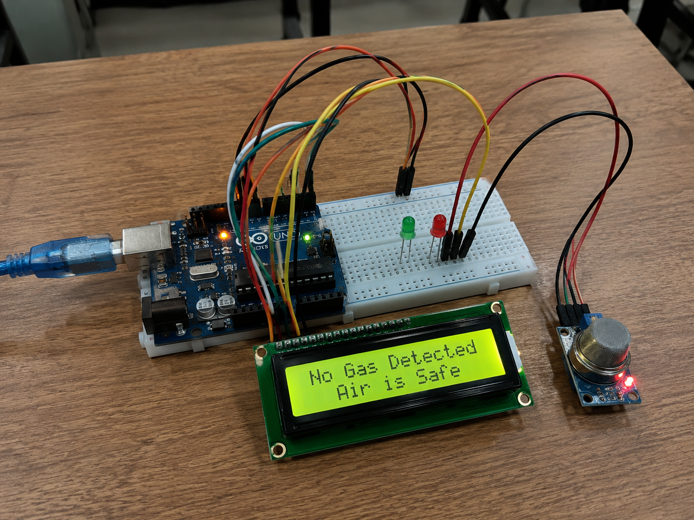
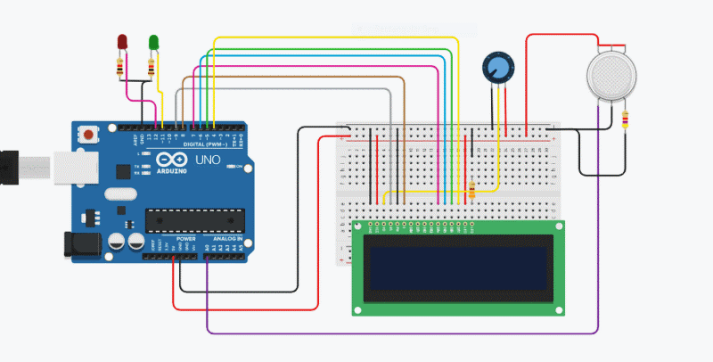
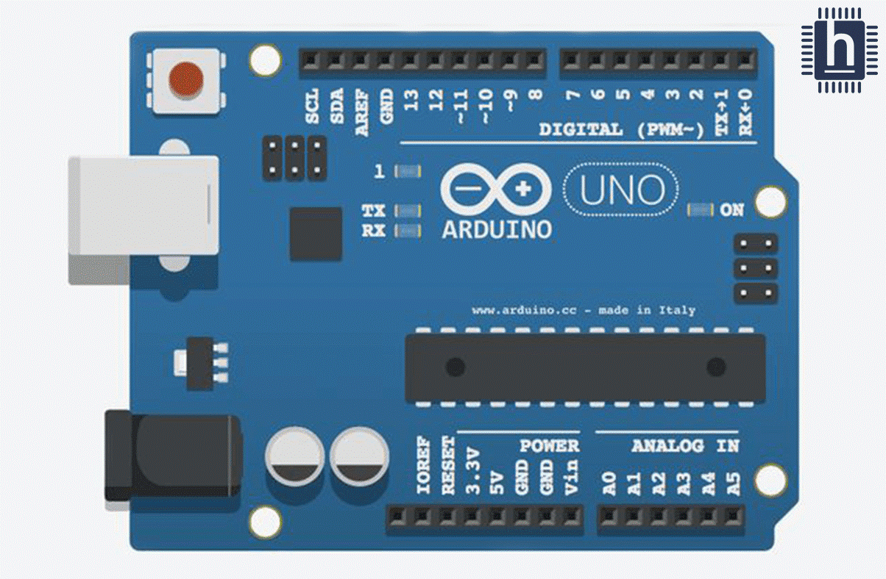

# IoT-Based Gas Leakage Detection System

An IoT-based Gas Leakage Detection System developed using **Arduino UNO**, **MQ-2 Gas Sensor**, and **16×2 I2C LCD** to detect hazardous gas leaks in real time. The system continuously monitors the surrounding environment and provides immediate visual alerts when dangerous gas concentrations are detected, helping improve safety in residential, commercial, and industrial environments.

---

## 📖 Project Overview

Gas leakage is a major cause of fire accidents and health hazards in homes and industries. This project provides a low-cost and reliable solution for detecting combustible gases using the MQ-2 sensor. Whenever the gas concentration exceeds a predefined threshold, the system immediately alerts the user through LEDs and an LCD display.

---

## ✨ Features

- 🔍 Real-time gas leakage detection
- ⚡ Instant visual alert using LEDs
- 📟 LCD displays system status
- 🏠 Suitable for home and industrial safety
- 💰 Low-cost implementation
- 🔧 Easy to build and maintain
- 📈 Continuous monitoring of gas levels

---

## 🛠️ Hardware Components

| Component | Quantity |
|-----------|---------:|
| Arduino UNO | 1 |
| MQ-2 Gas Sensor | 1 |
| 16×2 LCD with I2C Module | 1 |
| Red LED | 1 |
| Green LED | 1 |
| Breadboard | 1 |
| Jumper Wires | As Required |
| USB Cable | 1 |
| LPG Gas Source (Testing) | 1 |

---

## 💻 Software Used

- Arduino IDE
- Embedded C / Arduino Programming
- Windows 11

---

## ⚙️ Working Principle

1. The MQ-2 sensor continuously monitors the surrounding air.
2. Arduino reads the sensor output.
3. If gas concentration exceeds the threshold:
   - 🔴 Red LED turns ON
   - 🟢 Green LED turns OFF
   - 📟 LCD displays **"Gas Detected!"**
4. When no gas is detected:
   - 🟢 Green LED remains ON
   - 🔴 Red LED remains OFF
   - 📟 LCD displays **"No Gas Detected"**

---

## 🔄 System Flow

```text
Gas Leakage
      │
      ▼
MQ-2 Gas Sensor
      │
      ▼
Arduino UNO
      │
 ┌────┴────┐
 │         │
 ▼         ▼
LCD      LEDs
(Display) Alert
```

---

## 📂 Repository Structure

```text
IoT-Gas-Leakage-Detection-System
│
├── Arduino_Code/
│   └── Gas_Leakage_Detection.ino
│
├── Circuit_Diagram/
│   ├── Wiring_Diagram.png
│   
├── Documentation/
│   └── IoT_Mini_Project_Report.pdf
│
├── Images/
│   ├── Hardware_Setup.jpg
│   ├── MQ2_Sensor.jpg
│   ├── Arduino_UNO.jpg
│   ├── LCD_Display.jpg
│   └── Working.jpg
│
├── README.md
└── LICENSE
```

---

## 📷 Project Images

### Hardware Setup

<p align="center">
  
</p>

---

### Circuit Diagram

<p align="center">
  
</p>


### Arduino UNO Circuit Board

<p align="center">
  
</p>
---


---

## 🚀 Applications

- Smart Homes
- LPG Gas Leakage Detection
- Restaurants and Hotels
- Laboratories
- Chemical Industries
- Manufacturing Plants
- Gas Storage Facilities

---

## 🔮 Future Enhancements

- 📲 Mobile Application Integration
- ☁️ IoT Cloud Monitoring
- 📡 GSM/SMS Alert System
- 📈 Gas Concentration Graphs
- 🔔 Buzzer Notification
- 🌐 Remote Monitoring Dashboard

---

## 🎯 Learning Outcomes

- Arduino Programming
- Sensor Interfacing
- I2C Communication
- Embedded Systems
- IoT Fundamentals
- Circuit Design

---

## 👨‍💻 Author

**Mohan Ugale**

Bachelor of Engineering (Artificial Intelligence & Data Science)

Pune Vidyarthi Griha’s College of Engineering & S S Dhamankar Institute of Management, Nashik

Savitribai Phule Pune University

---

## ⭐ If you found this project useful, don't forget to Star this repository!
